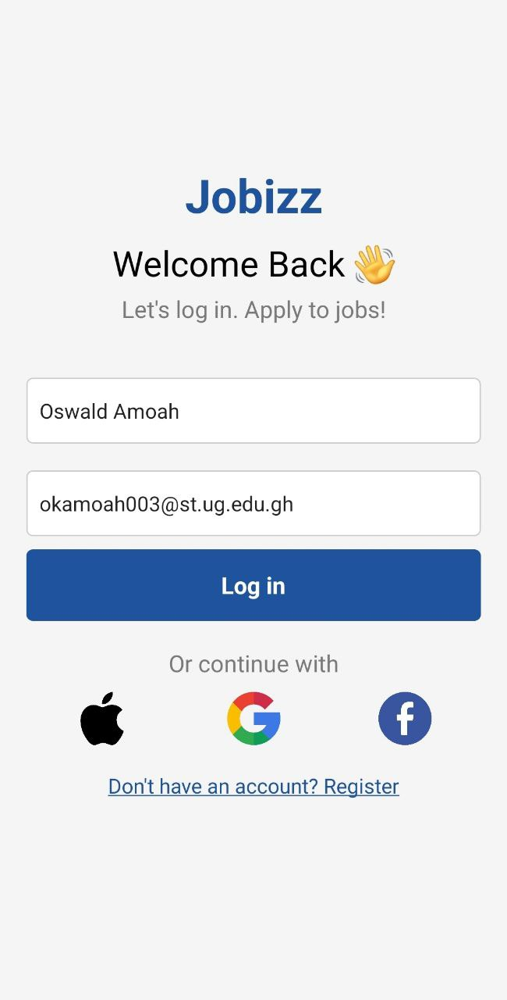
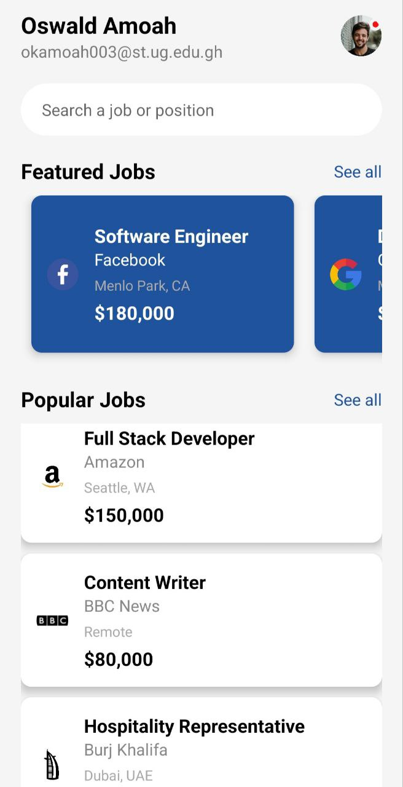

# DCIT202 ASSIGNEMNT 2
# 11046928

## Overview

The **Jobizz App** is a React Native application designed to help users search for and view job listings. The app is divided into two main components:

1. **LoginScreen**: Allows user to login to access Homescreen
2. **HomeScreen**: Displays user information, a search bar, and lists of featured and popular jobs.

## Components
### HomeScreen

The `LoginScreen` component is the first screen of the app. It serves the following purposes:

- **Allows input**: It shows 2 input fields for name and email.
- **Extra Buttons**: It has extra buttons for Apple, Google and Facebook login.

### HomeScreen

The `HomeScreen` component is the main screen of the app. It serves the following purposes:

- **Displays User Information**: Shows the logged-in user's name and email.
- **Search Functionality**: Provides a search bar for users to search for jobs.
- **Featured Jobs Section**: Lists jobs marked as featured.
- **Popular Jobs Section**: Lists other popular jobs.

### JobCard

The `JobCard` component represents individual job listings. It includes:

- **Job Title**: The position title for the job.
- **Company**: The company offering the job.
- **Location**: The geographical location of the job.
- **Salary**: The salary range for the job.
- **Job Image**: A logo or image representing the job or company.

## Screenshots

